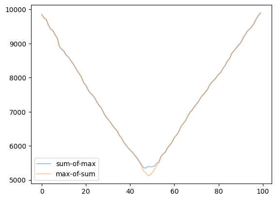
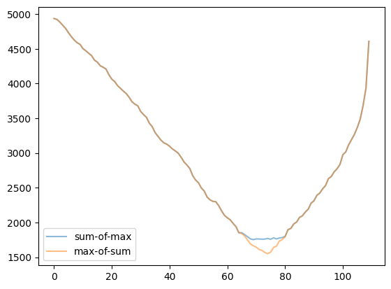
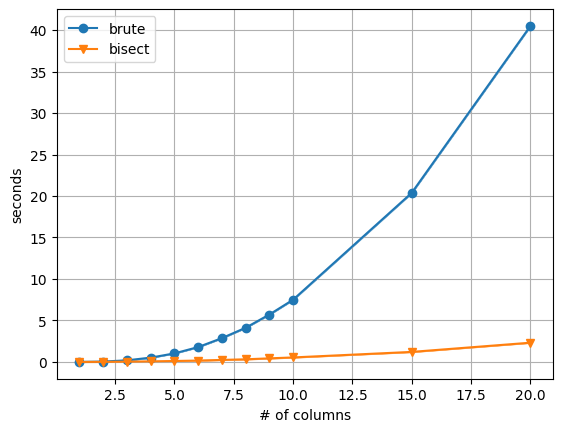

# Abstract

This page explains the column planner of `tabulate`, which automatically decides the width of each column of the rendered table, in order to minimize the total number of lines taken by the table.
We start from a dynamic programming planner based on brute-force line search, and then explore how we may improve it with bisect algorithm, by leveraging the monotonicity of the lower bound of our objective.

# Introduction

Notation:

- Let $N$ denote the total number of columns whose widths are not specified by the user.
- Let $W$ denote the total width budget of the table.
- Let $c_r^k(w)$ denote the minimum number of lines taken by the $r$-th row and the first $k$ columns of the table, with a total width budget of $w$ over the $k$ columns. $\sum_r c_r^N(W)$ will be the minimum total number of lines taken by the table.
- Let $n_r^k(w)$ denote the number of lines taken by the $r$-th row and the $k$-th column of the table, whose column width is $w$. This quantity is reported by the underlying [line-wrapping algorithm][textwrap-rs]. By the nature of the line wrapping problem, we assume that $n_r^k(w)$ is monotonically non-increasing in $w$.
- Let $b_r$ denote the number of lines taken by the $r$-th row of all columns whose widths have been specified by the user. This quantity is also reported by the line-wrapping algorithm.
- Let $c_r^k(w,i)$ be a proposal of allocating width $i$ to the $k$-th column, and leave $w-i$ width to the first $(k-1)$ columns. $c_r^k(w)$ equals one of the $c_r^k(w,i)$ with the optimal decision $i$.

In code, $c$ is denoted by `dp`, and $n$ is denoted by `nl`.
<!-- TODO add code link -->

Almost immediately, we have the inductive definition of $c_r^k(w)$ as follows:

$$
\begin{aligned}
c_r^0(w) &\triangleq \max(b_r, n_r^0(w))\,\\
c_r^k(w,i) &\triangleq \max(c_r^{k-1}(w-i), n_r^k(i))\,\\
c_r^k(w) &\triangleq c_r^k(w, i^\ast)\,\\
\text{where } i^\ast &= \arg \min_{i \le w} \sum_r c_r^k(w,i)\,.
\end{aligned}
$$

Apparently, $i^\ast$ is the optimal *decision*, the optimal width allocated to the $k$-th column while the first $k$ columns admit a total width budget $w$.

[textwrap-rs]: https://docs.rs/textwrap/latest/textwrap/

# Brute decision maker

We simply traverse all $i \le w$ and find the $i$ that minimize $\sum_r c_r^k(w,i)$.
Can we do better?

# Bisect decision maker

Before reaching our bisect optimization, we first observe that:

**Theorem 1.**
$c_r^k(w)$ is monotonically non-increasing in $w$. 
*Proof.*
We prove by induction.
Since $n_r^0(w)$ by assumption is monotonically non-increasing, and $b_r$ is constant in $w$, we may conclude that $c_r^0(w)$ is monotonically non-increasing.
Now suppose that $c_r^k(w)$ is monotonically non-increasing, then similarly, $c_r^{k+1}(w,i)$ is monotonically non-increasing in $w$ for all fixed decision $i$.
But $c_r^{k+1}(w)$ is a $c_r^{k+1}(w,i)$ with the optimal decision $i^\ast$, $c_r^{k+1}(w)$ is likewise monotonically non-increasing in $w$.
*QED.*

Given that $c_r^k(w)$ is monotonically non-increasing, we naturally notice that $c_r^k(w-i)$ is monotonically non-decreasing in $i$ for any fixed $w$.
Thus, while finding the optimal decision for the $k$-th column, we are minimizing $\sum_r \max(c_r^{k-1}(w-i), n_r^k(i))$, with the two arguments of the maximum being monotonically non-decreasing and non-increasing.

We may get inspired from a second theorem:

**Theorem 2.**
The minimum of the maximum between a monotonically non-decreasing series and a monotonically non-increasing series can be found using bisect algorithm. 
*Proof.*
We know for sure that the minimum can be achieved where the two series meet each other.
By assumption, one of the difference between the two series is monotonically non-decreasing.
So we are able to solve the original problem by finding the zero of the non-decreasing series, which can be solved using bisect algorithm.
At best, we will find the point closest to zero, and that will be our solution.
*QED*.

Since the summation keeps monotonicity, we are now able to efficiently find $\min_{i \le w}\max(\sum_r c_r^{k-1}(w-i), \sum_r n_r^k(i))$.
There's still a gap, since what we want to solve instead is $\min_{i \le w}\sum_r \max(c_r^{k-1}(w-i), n_r^k(i))$.
But the gap can be closed under specific condition:

**Lemma 1.**
$L(w,i) = \max(\sum_r c_r^{k-1}(w-i), \sum_r n_r^k(i))$ is a lower bound of our objective $\sum_r c_r^k(w,i)$.

**Theorem 3.**
If $L(w,i^\ast) = \min_{i \in S} L(w,i)$ and $L(w,i^\ast)$ is *tight*, then $i^\ast$ is also the minimizer of our objective over the set $S$. 
*Proof.*
Note the inequality:

$$
\sum_r c_r^k(w,i^\ast) = L(w,i^\ast) \le L(w,i) \le \sum_r c_r^k(w,i)\,,
$$

where the reasons of equality or inequality are: (1) the bound is tight at $i^\ast$; (2) $i^\ast$ is the minimizer of $L(w,i)$; (3) $L$ is a lower bound of our objective.
*QED.*

In fact, we may efficiently search the lower bound, and then explore around the minimum to actually find the real minimum:

**Lemma 2.**
If we suppose $L(w,i^\ast)$ minimizes $L(w,i)$, then $L(w,i)$ is monotonically non-increasing over $i \le i^\ast$, and monotonically non-decreasing over $i \ge i^\ast$.

**Theorem 4.**
Suppose $i^\ast$ is the minimizer of $L(w,i)$.
Suppose $i_l \le i^\ast$ is the largest position where $L(w,i)$ is tight, and $i_r \ge i^\ast$ is the smallest position where $L(w,i)$ is tight, then

$$
\arg\min_{i \le w} \sum_r c_r^k(w,i) = \arg\min_{i_l \le i \le i_r} \sum_r c_r^k(w,i)\,.
$$

*Proof.*
By Lemma 2, $i_l$ is the minimizer of $L(w,i)$ over $i \le i_l$.
By Theorem 3, $i_l$ is also the minimizer of $\sum_r c_r^k(w,i)$ over $i \le i_l$.
Similarly, $i_r$ is the minimizer of $\sum_r c_r^k(w,i)$ over $i \ge i_r$.
Therefore, we need only to search by brute-force the range $i_l \le i \le i_r$ in order to guarantee to find the real minimum.
*QED.*

How much computation can be saved then?
Unfortunately there's no theoretic guarantee.
But we may show empirically through simulation.
For example, the two figures below show the lower bound (orange) and the real objective (blue).
We only need to search in the region where they don't match:

## Infinite lines consumption

We assign $n_r^k(w) = \infty$ if the column is not wide enough to hold certain words, such that they protrude out the column and damage the table layout.
The infinite cost will prevent such case from happening, if ever possible.
We justify this setup below:

**Theorem 5.**
$n_r^k(w)$ is monotonically non-increasing at presence of infinity. 
*Proof.*
It's easy to show that introducing infinity does not ruin the monotonicity of $n_r^k(w)$ in $w$: if $n_r^k(w) = \infty$, then $n_r^k(w-1) = \infty$; if $n_r^k(w) < \infty$, then $n_r^k(w+1) < \infty$.
*QED.*

**Theorem 6.**
$L(w,i) = \infty$ if and only if $\exists r$, either $c_r^{k-1}(w-i)$ or $n_r^k(i)$ is infinity.

Here we show an important theorem:

**Theorem 7.**
If the lower bound $L(w,i)=\infty$, it's tight. 
*Proof.*
By Theorem 6 and definition of $L(w,i)$ and the objective $\sum_r c_r^k(w,i)$, it follows trivially that they are equal.
*QED.*

Therefore, when we follow Theorem 4 performing local line search, arriving at infinite lower bound also indicates tightness has been found.

# Benchmark

We empirically showcase the efficiency of the bisect optimization.

# Conclusion

Instead of brute search all possible $i \le w$ while making decision, we may opt to bisect followed by local search in the surrounding.
This greatly enhance the efficiency.
